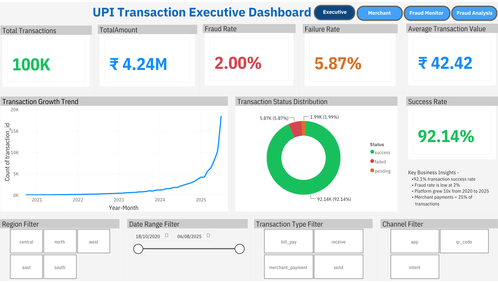
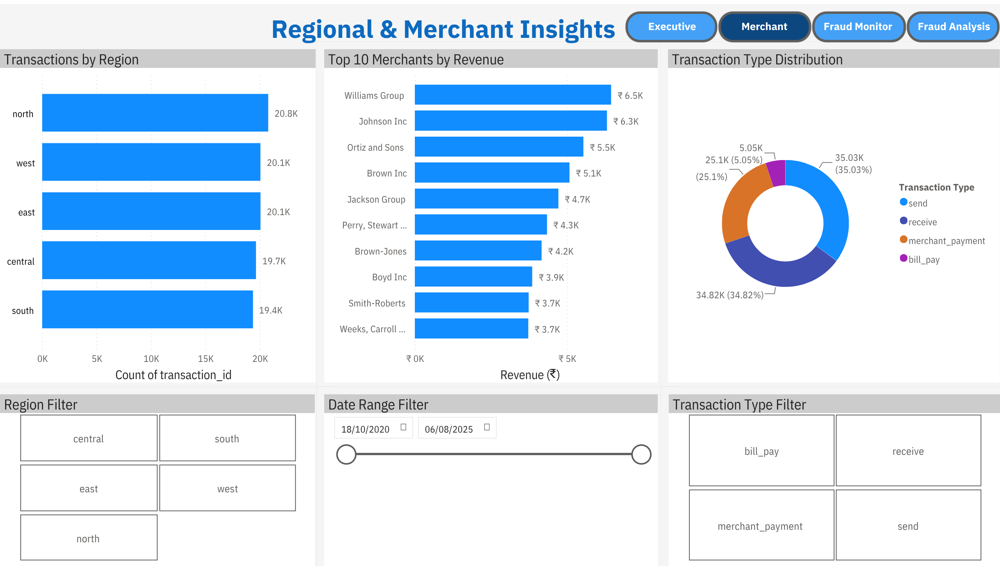
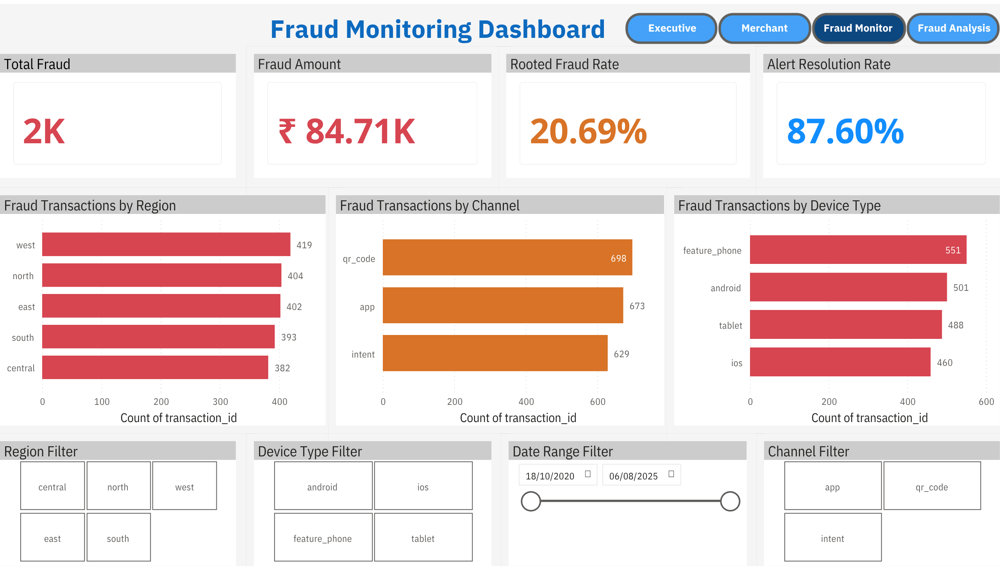
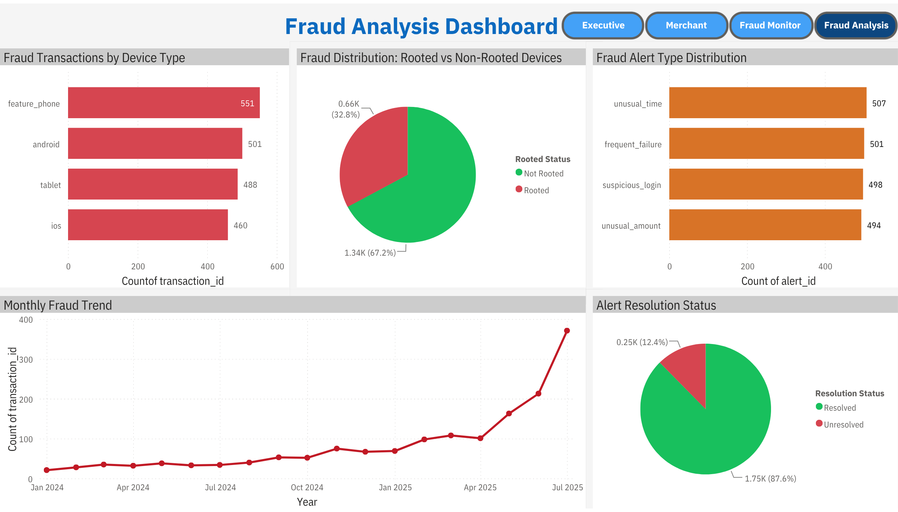

# 🔐 UPI Transaction Analytics & Fraud Detection

<div align="center">


**End-to-end data analytics project on a simulated UPI digital payments platform — covering database design, SQL analysis, Python EDA, statistical hypothesis testing, and interactive Power BI dashboards.**

[📊 View Power BI Dashboard](#-power-bi-dashboards) · [📓 Python Analysis](Python/upi_analysis.ipynb) · [🗄️ SQL Analysis](SQL/upi_analysis.sql) · [📄 Executive Report](Report/UPI_Executive_Report.pptx)

</div>

---

## 📋 Table of Contents

- [Project Overview](#-project-overview)
- [Business Problem](#-business-problem)
- [Tech Stack](#-tech-stack)
- [Dataset Summary](#-dataset-summary)
- [Database Schema](#-database-schema)
- [SQL Analysis](#-sql-analysis)
- [Python EDA](#-python-eda--visualizations)
- [Statistical Analysis](#-statistical-analysis)
- [Power BI Dashboards](#-power-bi-dashboards)
- [Key Insights](#-key-insights)
- [Business Recommendations](#-business-recommendations)
- [Business Impact](#-business-impact)
- [Skills Demonstrated](#-skills-demonstrated)
- [Project Structure](#-project-structure)
- [Future Improvements](#-future-improvements)
- [Author](#-author)

---

## 🔍 Project Overview

This project demonstrates an end-to-end data analytics workflow for a UPI digital payments platform, covering database design, SQL analytics, Python exploratory data analysis (EDA), statistical hypothesis testing, fraud detection, business intelligence reporting, and interactive Power BI dashboards.

1. **Database design** — Staging layer → normalized production schema with constraints and indexes in SQL Server
2. **Data ingestion & cleaning** — Type-safe ETL pipeline with FK validation, duplicate removal, and data quality views
3. **SQL analysis** — 25+ queries covering KPIs, fraud patterns, merchant performance, and customer segmentation
4. **Python EDA** — 14 statistical visualizations across transaction, customer, device, merchant, and feedback dimensions
5. **Statistical testing** — 6 hypothesis tests using SciPy to validate fraud patterns with statistical rigor
6. **Power BI dashboards** — 4 interactive dashboards with DAX measures, drill-downs, tooltips, and navigation
7. **Executive reporting** — 2-page business report with quantified recommendations

| Metric | Value |
|--------|-------|
| Total records processed | 139,500+ |
| Transactions analyzed | 100,000 |
| Customers | 10,000 |
| Merchants | 500 |
| Devices | 12,000 |
| UPI accounts | 12,000 |
| Fraud alerts | 2,000 |
| Customer feedback records | 4,000 |

---

## 💼 Business Problem

Unified Payments Interface (UPI) has revolutionized India's digital payments ecosystem, but rapid growth introduces serious operational challenges:

- **Fraud risk** — Are certain customer segments, devices, or channels disproportionately associated with fraudulent transactions?
- **Transaction failures** — What causes the platform's 5.87% failure rate, and which channels and devices are most affected?
- **Risk model accuracy** — Is the existing customer risk scoring model effectively identifying high-risk behaviour?
- **Merchant performance** — Which merchant categories generate the most revenue and which carry the highest fraud exposure?
- **Customer satisfaction** — What are the primary drivers of customer dissatisfaction, and how resolved are they?

This analysis addresses each of these questions with data-backed evidence and quantified business recommendations.

---

## 🛠 Tech Stack

| Layer | Tool | Purpose |
|-------|------|---------|
| Database | SQL Server (SSMS) | Schema design, data ingestion, analysis queries |
| Query Language | T-SQL | DDL, DML, CTEs, Window Functions, subqueries |
| Programming | Python 3 | EDA, statistical testing, visualization |
| Data Manipulation | Pandas, NumPy | Data cleaning, transformation, aggregation |
| Visualization | Matplotlib, Seaborn | 14 statistical charts and plots |
| Statistical Testing | SciPy | T-test, ANOVA, Chi-square, Pearson Correlation |
| BI & Dashboards | Power BI Desktop | 4 interactive dashboards with DAX |
| DAX | Power Query | Measures, calculated columns, data model |
| Reporting | PowerPoint | 2-page executive report |

---

## 🔄 Project Workflow

```text
Raw CSV Files
      ↓
SQL Server Database
      ↓
Data Cleaning & Validation
      ↓
SQL Analysis
      ↓
Python EDA & Statistical Testing
      ↓
Power BI Dashboards
      ↓
Business Insights & Recommendations
```

---

## 📦 Dataset Summary

Seven interrelated tables covering all dimensions of UPI platform operations:

| Table | Records | Description |
|-------|---------|-------------|
| `customer_master` | 10,000 | Customer profiles — demographics, risk scores, join dates |
| `merchant_info` | 500 | Merchant registry — category, region, risk score, onboard date |
| `device_info` | 12,000 | Device inventory — type, app version, rooted status, last activity |
| `upi_account_details` | 12,000 | UPI handle registry — bank, account type, status |
| `upi_transaction_history` | 100,000 | Transaction ledger — amount, type, channel, fraud/reversal flags |
| `fraud_alert_history` | 2,000 | Fraud alert log — alert type, resolution status, resolution time |
| `customer_feedback` | 4,000 | Satisfaction surveys — scores, issue types, resolution status |

**Data span:** October 2020 – August 2025  
**Total records:** 139,500+

---

## 🗄 Database Schema

The production schema implements a normalized relational design with strict referential integrity:

```
customer_master (PK: customer_id)
    │
    ├──► device_info (FK: customer_id)
    ├──► upi_account_details (FK: customer_id)
    ├──► customer_feedback (FK: customer_id)
    │
    └──► upi_transaction_history (FK: customer_id)
              │
              ├──► merchant_info (FK: merchant_id)
              ├──► device_info (FK: device_id)
              ├──► upi_account_details (FK: upi_id)
              │
              └──► fraud_alert_history (FK: transaction_id)
```

**Schema highlights:**
- 7 production tables + 7 staging tables (two-layer ingestion architecture)
- 8 foreign key constraints enforcing referential integrity
- Check constraints: `age >= 18`, `amount > 0`, `risk_score BETWEEN 0 AND 1`, `satisfaction_score BETWEEN 1 AND 5`
- `UNIQUE` constraint on `mobile_number`; `DATETIME2` for high-precision timestamps
- `vw_clean_customer` — SQL view for data quality filtering (invalid mobile numbers flagged)
- 5 composite and single-column indexes on high-frequency query columns

**Performance indexes:**

```sql
-- Composite indexes on the highest-traffic table
CREATE INDEX idx_customer_time  ON upi_transaction_history(customer_id, timestamp);
CREATE INDEX idx_merchant_time  ON upi_transaction_history(merchant_id, timestamp);
CREATE INDEX idx_fraud_time     ON upi_transaction_history(fraud_flag, timestamp);
CREATE INDEX idx_alert_txn      ON fraud_alert_history(transaction_id);
CREATE INDEX idx_feedback_cust  ON customer_feedback(customer_id);
```

---

## 🗃 SQL Analysis

The SQL script (`SQL/upi_analysis.sql` — 1,023 lines) is structured in eight analytical sections:

### Section 1 — Data Validation
Row count verification across all 7 tables, NULL audits on critical columns (`transaction_id`, `amount`, `fraud_flag`, `merchant_id`), and FK relationship validation.

### Section 2 — Exploratory Data Analysis
Transaction status distribution with window-function percentages, monthly trend analysis, and channel-device cross-analysis.

```sql
-- Example: Monthly growth with LAG window function
WITH monthly AS (
    SELECT YEAR(timestamp) AS yr, MONTH(timestamp) AS mn,
           COUNT(*) AS txn_count,
           ROUND(SUM(amount), 2) AS total_amount
    FROM dbo.upi_transaction_history
    GROUP BY YEAR(timestamp), MONTH(timestamp)
)
SELECT yr, mn, txn_count, total_amount,
       LAG(total_amount) OVER (ORDER BY yr, mn) AS prev_month,
       ROUND((total_amount - LAG(total_amount) OVER (ORDER BY yr, mn)) * 100.0 /
             NULLIF(LAG(total_amount) OVER (ORDER BY yr, mn), 0), 2) AS growth_pct
FROM monthly ORDER BY yr, mn;
```

### Section 3 — Core KPIs
Single-query executive dashboard extracting failure rate, fraud rate, reversal rate, average transaction value, and total revenue simultaneously.

### Section 4 — Fraud Analysis
Fraud rates segmented by region, channel, device type, and rooted status. High-risk customer identification using `HAVING` on aggregated fraud counts.

```sql
-- Rooted device fraud analysis
SELECT d.is_rooted,
       COUNT(*) AS total_txn,
       SUM(CASE WHEN t.fraud_flag = 1 THEN 1 ELSE 0 END) AS fraud_txn,
       ROUND(SUM(CASE WHEN t.fraud_flag = 1 THEN 1 ELSE 0 END) * 100.0 /
             COUNT(*), 2) AS fraud_rate_pct
FROM dbo.device_info d
JOIN dbo.upi_transaction_history t ON d.device_id = t.device_id
GROUP BY d.is_rooted;
```

### Section 5 — Failure Analysis
Failure reason distribution, failure rates by channel and device type, with window-function percentage breakdowns.

### Section 6 — Business Insights
Top-10 merchants by revenue with fraud exposure, merchant performance by category (LEFT JOIN), customer risk segmentation (three-tier CASE WHEN), and a 5-table Customer 360 view joining all entity dimensions.

### Section 7 — Advanced SQL
- **CTE + LAG:** Month-over-month revenue growth calculation
- **Window Function:** `RANK()` for customer spending leaderboard
- **Subquery:** Above-average transaction filter
- **CASE WHEN categorization:** Transaction value banding with fraud rate per band

### Section 8 — Interview-Calibre Queries
Customers with zero transactions (LEFT JOIN + NULL filter), merchants exceeding the platform-average fraud rate (subquery in `HAVING`), and recent fraud detection using `DATEADD`.

---

## 📊 Python EDA & Visualizations

**Notebook:** `Python/upi_analysis.ipynb` (54 cells)

**Connection:** SQLAlchemy → SQL Server via pyodbc, loading all 7 tables into Pandas DataFrames for analysis.

### Data Quality & Type Correction
- Detected and corrected 4 date columns stored as `object` → converted to `datetime64`
- Confirmed 69,851 NULL `merchant_id` values are valid (peer-to-peer transactions — Send/Receive types)
- Confirmed 248 NULL `resolution_date` values are valid (unresolved fraud alerts)

### 14 Visualizations Produced

| # | Visualization | Key Finding |
|---|---------------|-------------|
| 1 | Transaction Status Distribution (bar + pie) | 92.1% success, 5.87% failed |
| 2 | Monthly Transaction Trend (dual line chart) | 10× growth from 2020 to 2025, peak Jul 2025 |
| 3 | Amount Distribution (histogram + boxplot) | Right-skewed; mean ₹42.42, max ₹830.46 |
| 4 | Transaction Type & Channel (bar charts) | Send/Receive dominate; all 3 channels equal |
| 5 | Fraud vs Non-Fraud + by Channel & Device | 2% overall fraud rate; QR Code highest at 2.1% |
| 6 | Customer Demographics (gender, region, age) | Near-equal gender split; uniform regional distribution |
| 7 | Risk Score Distribution (customer + merchant) | Both right-skewed; avg customer risk 0.20 |
| 8 | Device Type & Rooted Status | 3.1% rooted; rooted fraud rate 20.69% vs 1.39% |
| 9 | Merchant Analysis (type + top 10) | Williams Group leads; Apparel has most merchants |
| 10 | Feedback Analysis (scores + issue types) | Avg satisfaction 3.61/5; transactions are #1 complaint |
| 11 | Fraud Alert Analysis (type + resolution) | 87.6% resolved; all 4 alert types uniformly distributed |
| 12 | Correlation Heatmap | No strong linear correlations — fraud is multi-factorial |
| 13 | Failure Reason Distribution | Breakdown of failure causes by frequency |
| 14 | Risk Score vs Fraud (bar chart) | Nearly identical scores for fraud/non-fraud customers |

---

## 📐 Statistical Analysis

Six hypothesis tests using `scipy.stats` to validate observations with statistical rigor:

| Test | Hypothesis | p-value | Result |
|------|-----------|---------|--------|
| T-Test | Fraud transactions have higher amounts than non-fraud | 0.9355 | ❌ Not significant |
| T-Test | Rooted devices transact higher amounts than normal devices | 0.3544 | ❌ Not significant |
| ANOVA | Transaction amounts differ significantly across regions | 0.8436 | ❌ Not significant |
| Chi-Square | Fraud is associated with payment channel | 0.1434 | ❌ Not significant |
| **Chi-Square** | **Fraud is associated with rooted device status** | **0.0000** | ✅ **Highly significant** |
| Pearson Correlation | Customer risk score predicts fraud occurrence | 0.6123 | ❌ Not significant |

**Critical finding:** The only statistically significant relationship is between rooted devices and fraud (p = 0.0000). This finding — that rooted devices carry **15× higher fraud risk** (20.69% vs 1.39%) — is robust, actionable, and directly informs the primary business recommendation.

**Secondary finding:** The customer risk scoring model shows **no statistically significant correlation with actual fraud** (p = 0.6123), indicating the existing model requires recalibration.

---

## 📈 Power BI Dashboards

**File:** `PowerBI/upi_analysis.pbix`  
**Published:** Available as a live interactive report

Four dashboards covering distinct analytical perspectives, connected through a unified data model with DAX measures and cross-page navigation buttons.

### Dashboard 1 — Executive Dashboard
**Audience:** C-suite, senior management  
**KPIs:** Total Transactions (100K), Revenue (₹4.24M), Success Rate (92.14%), Fraud Rate (2.00%), Failure Rate (5.87%), Avg Transaction Value (₹42.42)  
**Visuals:** Transaction growth trend (Jan 2024–Aug 2025), transaction status donut chart, key business insights text panel  
**Filters:** Region, Date Range, Transaction Type, Channel

### Dashboard 2 — Regional & Merchant Insights
**Audience:** Business development, merchant relations  
**Visuals:** Transactions by region (horizontal bar), Top-10 merchants by revenue (₹), transaction type distribution (donut)  
**Filters:** Region, Date Range, Transaction Type

### Dashboard 3 — Fraud Monitoring Dashboard
**Audience:** Risk and compliance teams  
**KPIs:** Total Fraud (2K), Fraud Amount (₹84.71K), Rooted Device Fraud Rate (20.69%), Alert Resolution Rate (87.60%)  
**Visuals:** Fraud transactions by Region, Channel, and Device Type (side-by-side bar charts)  
**Filters:** Region, Device Type, Date Range, Channel

### Dashboard 4 — Fraud Analysis Dashboard
**Audience:** Fraud analysts, security teams  
**Visuals:** Fraud by device type, Rooted vs Non-Rooted fraud pie chart, Fraud Alert Type Distribution, Monthly Fraud Trend (2024–2025), Alert Resolution Status  
**Features:** Tooltip page with 4 KPI cards on hover, DAX-calculated resolution status labels

---

## 💡 Key Insights

### 1. 🚨 Rooted Devices Are a Critical Fraud Vector
Only **3.1% of devices** are rooted, yet they account for **32.8% of all fraud transactions**. The fraud rate on rooted devices is **20.69%** compared to just **1.39%** on normal devices — a **15× difference confirmed statistically at p = 0.0000**.

### 2. 📉 Transaction Failures Drive Customer Dissatisfaction
The platform records a **5.87% transaction failure rate** (5,871 failed transactions). Feedback analysis reveals that **50.6% of all customer complaints** (2,025 of 4,000 records) relate to transaction issues, with an average satisfaction score of **3.61 out of 5**.

### 3. ✅ Platform Health Is Strong Overall
A **92.14% transaction success rate** across 100,000 transactions, with **87.6% of fraud alerts resolved** and fraud concentrated on a small, identifiable device segment — indicating the platform has a strong foundation with targeted vulnerabilities.

### 4. 📊 Risk Scoring Model Is Ineffective
Fraud and non-fraud customers have nearly identical average risk scores (0.201 vs 0.203). Pearson Correlation yields p = 0.6123 — statistically not significant. The model cannot distinguish high-risk customers from low-risk ones and requires a complete feature overhaul.

### 5. 📈 Platform Has Grown 10× in Five Years
Transaction volume grew from near-zero in 2020 to over **17,000 transactions in July 2025**, representing approximately 10× growth. Total platform revenue reached **₹4.24 million** across the analysis period.

### 6. 🏪 Merchant Revenue Highly Concentrated
The top 10 merchants — led by Williams Group (₹6.5K), Johnson Inc (₹6.3K), and Ortiz and Sons (₹5.5K) — contribute a disproportionate share of revenue, creating both concentration risk and a clear priority list for merchant relationship management.

---

## 📋 Business Recommendations

### Recommendation 1 — Block or Flag Rooted Device Transactions 🔴 Critical
**Problem:** Rooted devices drive 32.8% of all fraud despite representing 3.1% of the device base.  
**Action:** Implement real-time rooted device detection at transaction initiation. Require additional authentication (OTP + biometric) for flagged devices. Consider blocking high-risk transaction types from rooted devices entirely.  
**Estimated impact:** ₹27,800 in fraud loss prevention (32.8% of ₹84,710 total fraud amount)

### Recommendation 2 — Investigate and Resolve Transaction Failures 🟠 High Priority
**Problem:** 5,871 failed transactions and transaction issues account for the majority of customer complaints.  
**Action:** Conduct root-cause analysis on failure reason distribution. Improve payment gateway reliability and implement intelligent retry logic for recoverable failures. Set an internal SLA to reduce failure rate from 5.87% to below 3%.  
**Estimated impact:** Recovering 2,871 transactions at ₹42.42 average ≈ **₹1,21,700 in additional revenue**

### Recommendation 3 — Recalibrate the Customer Risk Scoring Model 🟡 Strategic
**Problem:** Existing risk scores show zero correlation with actual fraud occurrence (p = 0.6123).  
**Action:** Rebuild the risk model incorporating device rooting status, transaction frequency anomalies, time-of-day patterns, geographic velocity signals, and historical fraud flags. Validate using A/B testing before production deployment.  
**Estimated impact:** Improved early fraud detection, reduced manual review costs, and better precision in fraud alert targeting

---

## 💰 Business Impact

| Recommendation | Type | Estimated Value |
|----------------|------|----------------|
| Rooted device fraud blocking | Cost saving | ₹27,800 |
| Transaction failure reduction | Revenue recovery | ₹1,21,700 |
| Risk model recalibration | Operational efficiency | Qualitative |
| **Total quantified impact** | | **₹1,49,500** |

---

## 🧠 Skills Demonstrated

| Category | Skills |
|----------|--------|
| **Database** | Relational schema design, normalization, DDL/DML, referential integrity, indexing |
| **SQL** | Multi-table JOINs, CTEs, Window Functions (RANK, LAG), subqueries, HAVING, CASE WHEN, NULLIF |
| **Data Engineering** | Two-layer ETL (staging → production), type conversion, FK validation, data quality views |
| **Python** | Pandas, NumPy, Matplotlib, Seaborn — EDA, data cleaning, datetime handling |
| **Statistics** | T-test, ANOVA, Chi-square, Pearson Correlation, p-value interpretation |
| **Power BI** | Data modelling, DAX measures, KPI cards, drill-downs, tooltips, navigation, slicers |
| **Analytics** | KPI definition, fraud detection, customer segmentation, cohort thinking |
| **Business** | Translating data findings into quantified financial recommendations |
| **Communication** | Executive report writing, visual storytelling, insight summarisation |

---

## 📁 Project Structure

```
UPI-Transaction-Analytics-Fraud-Detection
│
├── README.md
│
├── SQL/
│
├── Python/
│   ├── upi_analysis.ipynb
│   ├── amount_distribution.png
│   ├── correlation_heatmap.png
│   ├── customer_demographics.png
│   ├── device_analysis.png
│   ├── feedback_analysis.png
│   ├── fraud_alert_analysis.png
│   ├── fraud_analysis.png
│   ├── merchant_analysis.png
│   ├── monthly_trend.png
│   ├── risk_distribution.png
│   ├── risk_fraud.png
│   ├── transaction_status.png
│   └── txn_type_channel.png
│
├── PowerBI/
│
├── Dashboard_Screenshots/
│   ├── executive_dashboard.png
│   ├── merchant_dashboard.png
│   ├── fraud_monitor_dashboard.png
│   └── fraud_analysis_dashboard.png
│
├── Dataset/
│
└── Report/
```

---

## 🖼 Dashboard Screenshots

### Executive Dashboard



### Merchant Dashboard



### Fraud Monitoring Dashboard



### Fraud Analysis Dashboard



---

## 🚀 How to Run This Project

### Prerequisites
- SQL Server (Express or Developer edition) + SSMS
- Python 3.8+ with: `pandas numpy matplotlib seaborn scipy sqlalchemy pyodbc`
- Power BI Desktop (free)

### Steps

**1. Database Setup**
```sql
-- Run SQL/upi_analysis.sql in SSMS
-- This will: create database → staging tables → production tables → run all analysis
```

**2. Python Notebook**
```bash
pip install pandas numpy matplotlib seaborn scipy sqlalchemy pyodbc
# Update connection string in Cell 2 with your SQL Server instance name
jupyter notebook "Python/upi_analysis.ipynb"
```

**3. Power BI**
```
Open PowerBI/upi_analysis.pbix in Power BI Desktop
Update the SQL Server data source connection string
Refresh data
```

---

## 🔧 Honest Assessment & Future Improvements

### What Could Be Stronger
- The staging tables use `VARCHAR(100)` for all columns — a pragmatic import choice, but production schemas would define proper types from the start
- The Python notebook connection string is hardcoded to a local SQL Server instance and will need updating to run on a different machine

### Planned Improvements
- [ ] Add a fraud prediction model (Logistic Regression / Random Forest) using the statistical findings as feature engineering guidance
- [ ] Replace hardcoded connection string with environment variable or config file
- [ ] Add a `requirements.txt` file for Python dependencies
- [ ] Parameterize the SQL script with variables for database name
- [ ] Add a data dictionary markdown file documenting each column

---

## 👤 Author

**Arup Ranjan**  
Data Analyst | B.Tech Computer Science (2025) | Data Analytics Program (Ongoing)

[](https://linkedin.com/in/arup-ranjananalytics)
[](mailto:arupranjan0563@gmail.com)

---

<div align="center">

**If this project was useful, please consider giving it a ⭐**

*Built as an End-to-End Data Analytics Capstone Project, 2026*

</div>